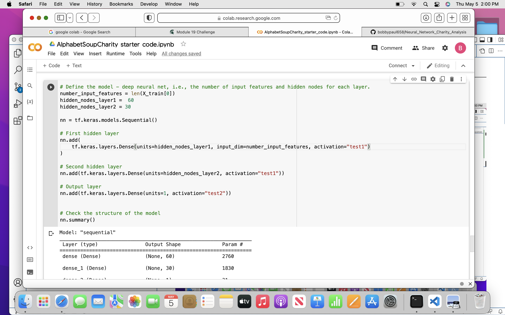
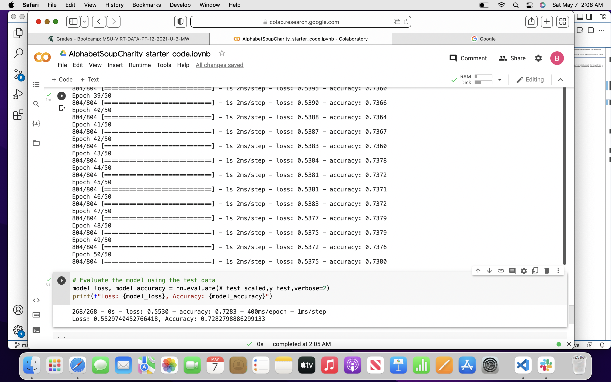

# Neural_Network_Charity_Analysis

The purpose is to help Beks to use neural networks with the tensor flow program to analyze the success of charitable donations.

##Results
Merged Data Frame 

for my neural network I had two hidden layers at a 60 neurons and 30. The activations output layer is "test2" hidden layers where classified as test1.

Results 55% loss
73% accuracy

##Summary
The deep learning model did not reach the target of 75%. The model is at 54%. You can contribute many examples such as the model being over fitted and removing data to improve the efficiency of it. Therefore, the model is not outperforming for Beks. Since we are using binary situations we can use different output and evaluate its performance against our deep learning model. The data also seems to be over fitted therefore in the future Beks may want to avoid this.